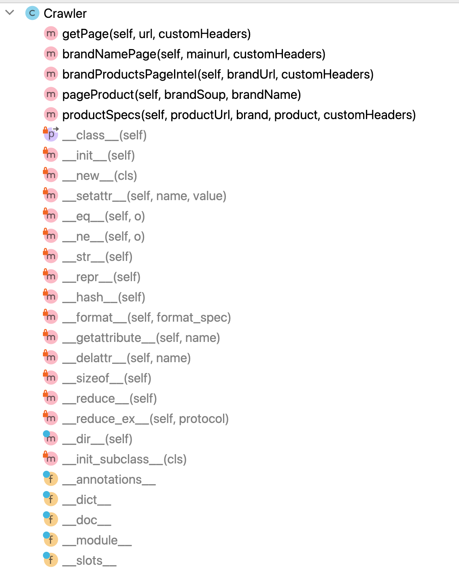

# Gsmarena Scrapy 
In this project, BeautifulSoup Library is utilised to extract phone, tablet, or other electronic device from gsmarena website by vendor. It could allow user to get noticed what the latest electronic device is. The information that is extracted includes vendor, product, its specification and its release date. In the end, output.txt will be the output file for user for further purpose.

Bascially, this project let me learn how the BeautifulSoup access and read information from the HTML. Learning by doing. In addition, from working on scraping, 'Visiting too much' problem is solved by  adding Headers.

The idea behind it: 
* 1. Visit main page 
* 2. Find Vendor List  
* 3. For each vendor 
* 4. Find its product list 
* 5. For each product, collect all its specification

**Table of Contents**

- [Getting Started]
    - [Prerequisites]
    - [Installing]
        - [Libraries]
- [Authors]
- [License]


## Getting Started
Requires:
* Python 3.8.8
* BeautifulSoup
* json
* pandas
* requests
* urllib

### Prerequisites

```
    Tools Required:
    Visual Studio or Pycharm (Any IDE could run Python)
```

### Installing

A few libraries needed to install to ensure that the code could run.

Say what the step will be

```
    pip install bs4
    pip install pandas
    pip install requests
```

To run the code, main.py is ready to run

## Crawler Object Structure 



## Versioning

Github/Git are used for versioning/sharing. 

## Authors

* **James Li** 

## License

This project is licensed under the MIT License - see the [LICENSE.md](LICENSE.md) file for details


